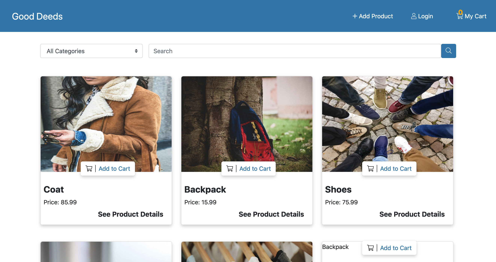
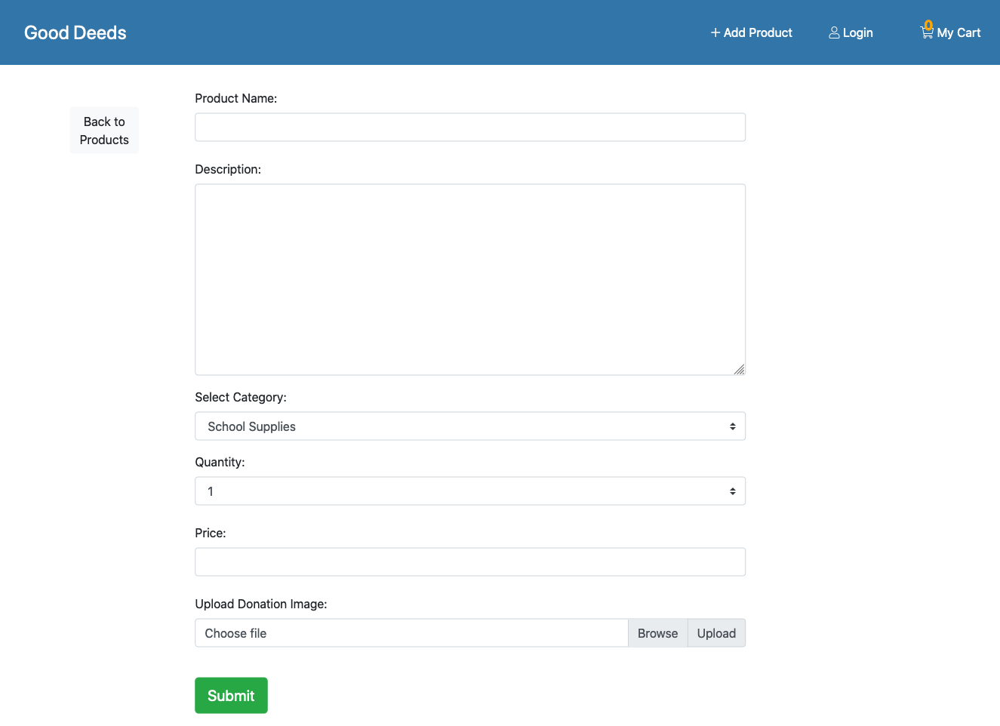
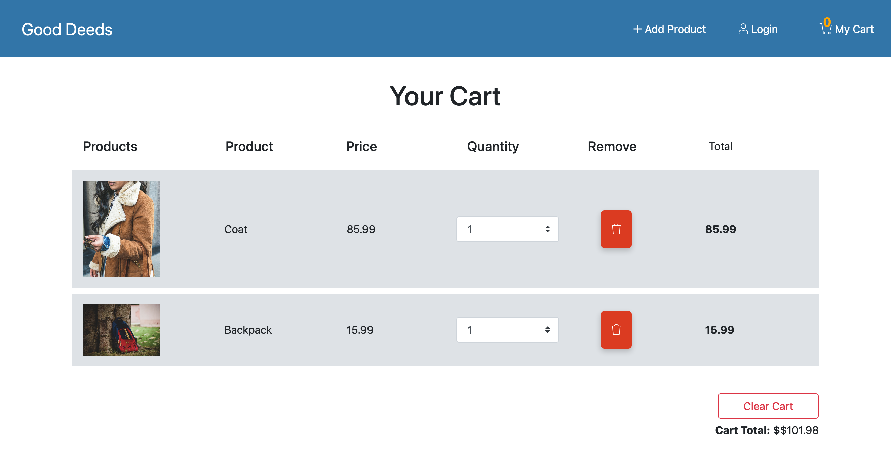

# Good Deeds
A donation web application that gives a donor and those of need ease of access to a charitable organization who can administer charitable donations much easier.

[Deployed Link](https://good-deeds-1.herokuapp.com/)

# Features
You will login to the homepage which will contain all products that are donated and available for charity. A needy person will be able to go to drop-down in nav bar that will query the products by category.  Then there is a search bar where a user can query specific items that are available. The products are contained in cards that display information and an Add to Cart button that will put the item in a cart. The cart has delete item button and clear cart buttons that will let you remove one item or clear the entire cart when pushed.  

## App Demo

### Home page 

### Add A Product

### View Cart

# Technologies used
* HTML
* CSS
* Bootstrap
* Node
* Express
* Express Sessions
* MySql with Sequelize ORM
* Passport for authentication 
* Bcrypt to encrypt passwords 
* Multer for image uploads

